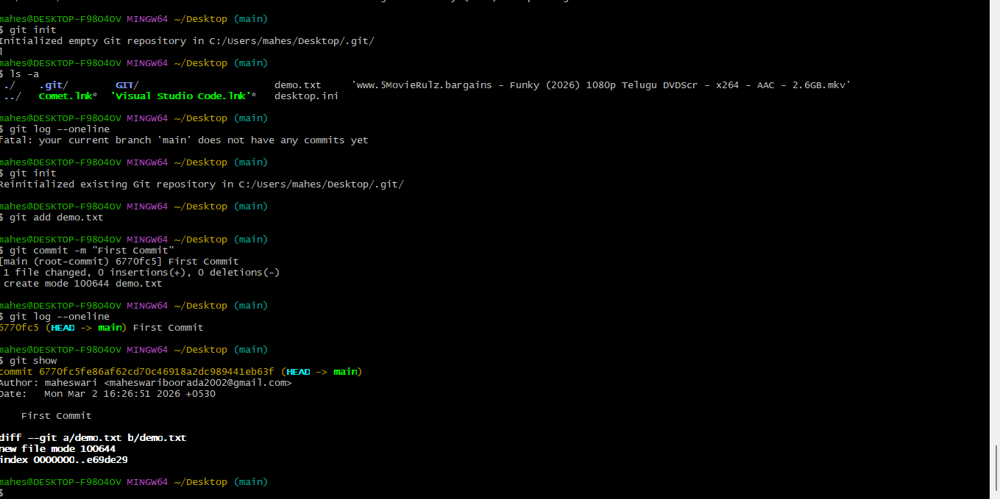
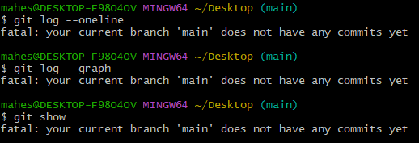
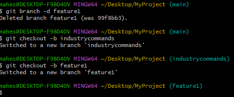

## git add

**Syntax:**
git add <file>

**Purpose:**
Stages a file to be included in the next commit.

**Example:**
git add demo.txt

**Screenshot:**

## git add -p

**Syntax:**
git add -p <file>

**Purpose:**
Stages changes in parts (hunks) interactively.

**Example:**
git add -p demo.txt

**Screenshot:**

## git restore

**Syntax:**
git restore <file>

**Purpose:**
Restores a file to its last committed state.

**Example:**
git restore demo.txt

**Screenshot:**

## git commit -m

**Syntax:**
git commit -m "message"

**Purpose:**
Commits staged changes with a message.

**Example:**
git commit -m "Update demo file"

**Screenshot:**

## git branch

**Syntax:**
git branch

**Purpose:**
Lists all branches in the repository.

**Example:**
git branch

**Screenshot:**

## git merge

**Syntax:**
git merge <branch-name>

**Purpose:**
Merges changes from one branch into another.

**Example:**
git merge feature1

**Screenshot:**
